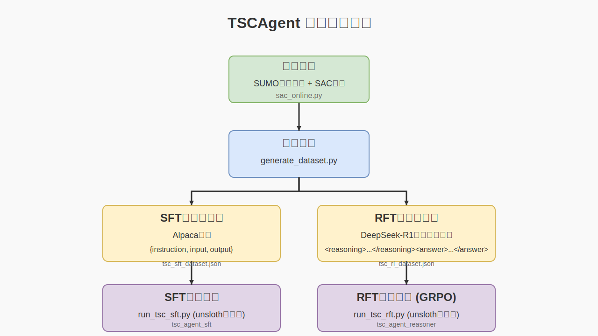

# TSCAgent: LLM-based Traffic Signal Control

## 项目概述

TSCAgent是一个基于大语言模型的交通信号控制系统，通过监督微调(SFT)和奖励微调(RFT)两种方式训练模型，实现智能交通信号控制。（一个demo，待优化，现有缺点：1.推理模型更高效的训练；2.没有考虑多交叉口协作。）

### 项目工作流程

下图展示了TSCAgent项目的完整工作流程，从数据采集、处理到模型训练和部署：



### 数据来源

- 基于成都市路网的SUMO仿真环境 `envs`
- 使用SAC强化学习算法生成训练数据 `history_data`
- 动作空间：相位选择
- 奖励函数：车辆排队长度
- 状态特征（路口的交通状况）：

| 特征     | 描述                                                     | 示例值                             |
| -------- | -------------------------------------------------------- | ---------------------------------- |
| 相位信息 | 相位数量、当前相位、持续时间                             | 4, [0,1,0,0], 10s                  |
| 交通状态 | 压力、绿灯状态                                           | 4辆车, 0                           |
| 车道信息 | 车道数量、特征统计[车道长度、数量、队列长度、速度、距离] | 2, [250m, 2辆, 1.5辆, 10m/s, 4.5m] |

- 数据预处理 `utils`
- sft数据：

```
"instruction": "你是一位交通管理专家。你可以运用你的交通常识知识来解决交通信号控制任务。根据给定的交通场景和状态，预测下一个信号相位。你必须直接回答：下一个信号相位是={你预测的相位}",

"input": "路口场景描述：该路口有4个相位，分别是[0,1,2,3]，有8个车道，分别是[0, 1, 2, 3, 4, 5, 6, 7]，其中相位0控制车道[0, 1]，相位1控制车道[3]，相位2控制车道[0, 2]，车道(0)的可观测范围为169.41米，(1)的可观测范围为169.41米，(2)的可观测范围为161.06米，(3)的可观测范围为250米，\n交通状态描述：目前该交叉口的当前相位为1，当前相位持续时间为30。\n相位(0)控制的车道的平均车辆数量为0.50，排队车辆为0.00，平均车速为0.49m/s，车辆到路口的平均距离为80.75米。\n相位(1)控制的车道的平均车辆数量为0.00，排队车辆为0.00，平均车速为0.00m/s，车辆到路口的平均距离为0.00米。\n相位(2)控制的车道的平均车辆数量为2.00，排队车辆为1.00，平均车速为0.64m/s，车辆到路口的平均距离为101.07米。",

"output": "下一个信号相位：2"
```

- rft数据：

```
"instruction": "你是一位交通管理专家。请根据给定的交通场景和状态，分析并预测下一个最优信号相位。\n\n关键概念说明：\n1. 信号相位：是指交通信号灯的一组状态组合，包括不同方向的车流通行权分配。\n2. 车道与相位关系：每个相位控制特定车道的通行权，需要考虑车道的交通流量和排队长度。\n3. 相位选择原则：\n   - 优先考虑排队长度最长的车道\n   - 考虑车道的交通流量和等待时间\n   - 注意交通拥堵主要由早期排队车辆决定\n   - 结合各个相位的车辆速度\n   - 不必紧急考虑远距离路段的车辆\n\n分析步骤：\n1. 分析当前交通状态\n2. 识别关键拥堵点\n3. 评估各相位优先级\n4. 选择最优相位\n\n请按以下格式回答：\n<reasoning>详细的分析推理过程</reasoning><answer>选择的相位ID\n<answer>选择的相位ID</answer>",
  
"input": "路口场景描述：该路口有4个相位，分别是[0,1,2,3]，有8个车道，分别是[0, 1, 2, 3, 4, 5, 6, 7]，其中相位0控制车道[0, 1, 2, 6, 7]，相位1控制车道[6, 7, 8]，相位2控制车道[3, 4, 5]，相位3控制车道[9, 10]，车道(0)的可观测范围为103.71米，(1)的可观测范围为103.71米，(2)的可观测范围为103.71米，(3)的可观测范围为250米，(4)的可观测范围为250米，(5)的可观测范围为250米，(6)的可观测范围为250米，(7)的可观测范围为250米，(8)的可观测范围为250米，(9)的可观测范围为91.76米，(10)的可观测范围为91.76米，\n交通状态描述：目前该交叉口的当前相位为2，当前相位持续时间为50。\n相位(0)控制的车道的平均车辆数量为0.40，排队车辆为0.40，平均车速为0.00m/s，车辆到路口的平均距离为0.40米。\n相位(1)控制的车道的平均车辆数量为1.33，排队车辆为1.33，平均车速为0.00m/s，车辆到路口的平均距离为2.37米。\n相位(2)控制的车道的平均车辆数量为0.00，排队车辆为0.00，平均车速为0.00m/s，车辆到路口的平均距离为0.00米。\n相位(3)控制的车道的平均车辆数量为3.00，排队车辆为3.00，平均车速为0.00m/s，车辆到路口的平均距离为8.00米。",
  
"output": "<reasoning>当前路口的相位为2，即相位(2)控制车道[3, 4, 5]。根据交通状态描述，我们分析如下：\n\n1. 相位(0)控制的车道[0, 1, 2, 6, 7]：平均车辆数量为0.40，排队车辆为0.40，平均车速为0.00m/s，平均距离为0.40米。有车辆在排队，但数量较少。\n\n2. 相位(1)控制的车道[6, 7, 8]：平均车辆数量为1.33，排队车辆为1.33，平均车速为0.00m/s，平均距离为2.37米。排队车辆略多于相位(0)。\n\n3. 相位(2)控制的车道[3, 4, 5]：平均车辆数量为0.00，排队车辆为0.00，平均车速为0.00m/s，平均距离为0.00米。当前相位，车道上没有车辆。\n\n4. 相位(3)控制的车道[9, 10]：平均车辆数量为3.00，排队车辆为3.00，平均车速为0.00m/s，平均距离为8.00米。排队车辆最多。\n\n综合考虑各相位控制的车道的车辆数量、排队长度和平均距离，相位(3)的排队车辆最多，且平均距离也最长，表明该相位的交通压力最大。因此，应优先考虑切换至相位(3)以缓解交通拥堵。\n\n<answer>3</answer>"
  
```

### 模型运行：

```
# 建议在colab上运行
pip install -r requirements.txt
python run_tsc_sft.py
python run_tsc_rft.py
```

### 数据和模型保存地址

- 数据集地址：[tsc-datasets](https://huggingface.co/datasets/jiam/tsc-datasets)
- 指令微调模型：[tsc_agent_sft](https://huggingface.co/jiam/tsc_agent_sft)
- 推理模型：[tsc_agent_reasoner](https://huggingface.co/jiam/tsc_agent_reasoner)

## 技术方案

### 1. 模型选择

- 指令微调模型：Qwen/Qwen2.5-7B-Instruct
- 推理模型：DeepSeek-R1-Distill-Qwen-1.5B（计算资源受限）

### 2. 训练数据

- SFT：1000条高质量样本
- RFT：1000-3000条样本
- 数据格式：统一模板，包含状态描述、决策依据和推理过程，具体见 `description_generator.py`

### 3. 推理数据生成

- 方法：CoT（思维链）推理
- 实现：大模型蒸馏，见 `generate_rl_dataset.py`

### 4. 训练框架

- 选项：Unsloth, trl
- 选择标准：显存效率、训练速度、社区支持

### 5. 部署要求

- 延迟：<100ms
- 硬件：GPU服务器
- 优化：模型量化部署

## To-Do List

### 1. 上下文设计

- 确定合适的时间窗口大小
- 设计历史决策序列的编码方式
- 优化交通流量变化的表示方法
- 平衡计算资源与性能

### 2. 可解释性增强

- 开发决策理由输出模块
- 实现可视化分析工具
- 设计专业术语转换系统

### 3. 外部工具调用

- 集成交通流预测模块的结果一同推理
- spatial-RAG提供地理空间信息来增强多交叉口协作
- 设计MCP接口等，更多上下文数据，比如天气、城市活动和交通事故报道

### 4. 多模式交通流和特殊场景

- 增加行人，自行车，公交车，应急车的多模态仿真构建
- prompt中的交通场景和状态描述重新设置

### 5. 多模态交通信号控制智能体

- 训练多模态模型，输入图片直接输出决策
